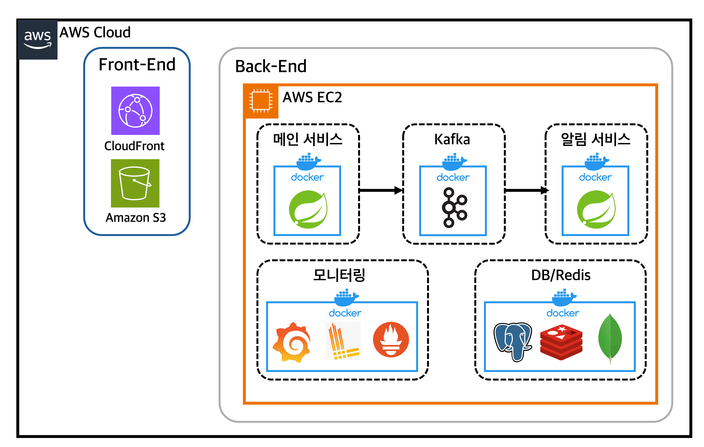

# Threadly
> 사진과 피드를 중심으로 한 심플한 SNS 백엔드 서비스입니다.

### Threadly: https://threadly.kr
### Threadly API: https://api.threadly.kr

---

## 백엔드 서비스 구성
 Threadly 백엔드는 **메인 서비스와 알림 서비스, 두 개의 레포지토리로 구성됩니다.**
 
## 메인 서비스(`threadly-service`)  
> 사용자, 게시글, 팔로우 등 SNS 핵심 도메인을 담당하는 **메인 서비스**입니다.
 
### GitHub Repo: https://github.com/KimGyuBek/threadly-service
### Swagger: https://swagger.threadly.kr/threadly/swagger-ui/index.html

 
 
## 알림 서비스(`notification-service`) 
> 실시간 알림, 메일 전송 등 알림을 담당하는 **알림 전용 서비스**입니다.

### GitHub Repo: https://github.com/KimGyuBek/notification-service
### Swagger: https://swagger.threadly.kr/swagger/notification/swagger-ui/index.html

---

## 핵심 성과

- [**피드 조회 쿼리 튜닝으로 `p95` 6.1s → 1.0s, `p99` 7.0s → 1.2s 수준으로 약 6배 성능 개선**](https://github.com/KimGyuBek/Threadly/wiki/%EC%BB%A4%EC%84%9C-%ED%8E%98%EC%9D%B4%EC%A7%95-%EC%84%B1%EB%8A%A5-%ED%8A%B8%EB%9F%AC%EB%B8%94%EC%8A%88%ED%8C%85)
- [**1,000만 건 하드 딜리트 배치 처리 시간을 340s → 34.5s로 약 10배 단축**](https://github.com/KimGyuBek/Threadly/wiki/%ED%95%98%EB%93%9C-%EB%94%9C%EB%A6%AC%ED%8A%B8-%EB%B0%B0%EC%B9%98-%EC%84%B1%EB%8A%A5-%EC%A0%80%ED%95%98-%ED%8A%B8%EB%9F%AC%EB%B8%94-%EC%8A%88%ED%8C%85)
- [**알림을 별도 서비스로 분리한 MSA 구조와 비동기 처리로, 부가 기능 장애가 메인 트랜잭션에 전파되지 않도록 구조화**](https://github.com/KimGyuBek/Threadly/wiki/%EC%95%8C%EB%A6%BC-%EB%B0%9C%ED%96%89-%EC%8B%A4%ED%8C%A8-%EC%8B%9C-%EC%A0%84%EC%B2%B4-%ED%8A%B8%EB%9E%9C%EC%9E%AD%EC%85%98-%EB%A1%A4%EB%B0%B1-%ED%8A%B8%EB%9F%AC%EB%B8%94-%EC%8A%88%ED%8C%85)
- [**`Kafka` 재시도 정책과 모니터링 환경을 구축해 알림 서비스의 장애 복원력을 강화**](https://github.com/KimGyuBek/Threadly/wiki/Kafka-%EC%9E%A5%EC%95%A0-%EC%9E%AC%EC%8B%9C%EB%8F%84-%EC%A0%84%EB%9E%B5)
- [**MSA 도입 과정에서 발생한 운영 서버 OOM 다운을 해결해 무중단 배포 환경 안정화**](https://github.com/KimGyuBek/Threadly/wiki/%EC%84%9C%EB%B9%84%EC%8A%A4-%EC%B6%94%EA%B0%80%EB%A1%9C-%EC%9D%B8%ED%95%9C-%EC%9A%B4%EC%98%81-%EC%84%9C%EB%B2%84-%EB%8B%A4%EC%9A%B4-%ED%8A%B8%EB%9F%AC%EB%B8%94-%EC%8A%88%ED%8C%85)

---

## 프로젝트 특징
### **구조**

- **헥사고날 아키텍처 기반 멀티모듈 구조**
- **도메인·인프라 의존성 분리, 메인 서비스/알림 서비스 MSA 분리**
- **`Kafka` 이벤트 기반 알림 비동기 처리로 핵심 트랜잭션과 분리**

### **운영 및 배포**

- **`Blue-Green` 무중단 배포 + `GitHub Actions` CI/CD 파이프라인 구축**
- **`AWS EC2`· `S3`·`CloudFront`, `Docker` 기반 실서비스와 동일한 배포 및 운영**

### **품질 및 문서화**

- **다양한 실제 사용자 흐름을 커버하는 시나리오 기반 통합 테스트, `Fixture` 기반 테스트 데이터로 품질 검증**
- **핵심 모듈 기준 `JaCoCo` 커버리지 80% 이상 유지**
- **높은 테스트 커버리지를 바탕으로 주요 비즈니스 흐름을 자동으로 검증할 수 있는 구조 확보**
- **트러블슈팅·설계·의사 결정 과정을 Wiki에 체계적으로 문서화**

---

## 전체 서비스 구성도

> 자세한 문서는 [운영 서버 구성 위키](https://github.com/KimGyuBek/Threadly/wiki/%EC%9A%B4%EC%98%81-%EC%84%9C%EB%B2%84-%EA%B5%AC%EC%84%B1)에서 확인 가능합니다.

---

## 사용 기술 스택
### 백엔드
`Java 17` `Spring Boot 3.3.3` `Spring Security` `Spring Data JPA` `Spring Batch` `Spring Cloud Stream`

### DB / 캐시
`PostgreSQL` `MongoDB` `Redis` `Flyway`

### 인프라 / 메시징
`Kafka` `Docker` `AWS EC2` `S3` `CloudFront` `GitHub Actions` `Prometheus` `Grafana` `Loki` `Promtail`

### 테스트 및 품질
`JUnit5` `k6` `JaCoCo` `Mockito`

---

## 테스트 전략

Threadly의 테스트는 단순 단위 테스트를 넘어서 **실제 서비스 흐름을 그대로 검증하는 API 통합 테스트에** 무게를 두고 설계했습니다.

- `app-api` 모듈에서 실제 요청/응답 흐름을 기반으로 **API 통합 (E2E 성격) 테스트 수행**([API 통합 테스트 목록](https://github.com/KimGyuBek/Threadly/wiki/API-integration-test-list))
- `core-service`, `adapter`  모듈에서는 도메인, 어댑터 단위 테스트로 내부 로직과 외부 연동 안정성 확보
- **주요 기능은 대부분 테스트로 보장되어 안정적인 배포 가능**

 

### 커버리지 및 품질 지표
- `jacoco`를 이용해 모듈별 커버리지를 측정하고, CI 단계에서 자동으로 리포트를 생성([CI 리포트 예시](https://github.com/KimGyuBek/threadly-service/actions/runs/19262210745))
- 도메인 서비스가 집중된 `core-service`와 API 통합테스트를 담당하는 `app-api` 모듈은 **80~90%대 높은 커버리지 유지**
- CI 파이프라인에서 자동 실행되며, 커버리지 결과는 `Job Summary`로 즉시 확인 가능

> 자세한 문서는 [테스트 구조 및 전략 위키 문서](https://github.com/KimGyuBek/Threadly/wiki/%ED%85%8C%EC%8A%A4%ED%8A%B8-%EA%B5%AC%EC%A1%B0-%EB%B0%8F-%EC%A0%84%EB%9E%B5)에서 확인할 수 있습니다.

---

## CI/CD 파이프라인 구축

Threadly는 **`GitHub Actions` 기반으로 테스트/빌드/배포까지 자동화된 파이프라인을 구성했습니다.**  
또한 `Slack`을 이용해 **워크플로우 성공/실패 알림을 받아**, 운영 상태를 빠르게 파악할 수 있도록 구성했습니다.

> 자세한 문서는 [CI CD 동작 프로세스 위키 문서](https://github.com/KimGyuBek/Threadly/wiki/CI-CD-%EB%8F%99%EC%9E%91-%ED%94%84%EB%A1%9C%EC%84%B8%EC%8A%A4)에서 확인 가능합니다.

---

## 트러블슈팅
개발 과정에서 실제로 마주했던 기술적 문제들에 대해 **어떤 고민을 했고 어떻게 해결했는지 그 과정을 트러블슈팅 문서로 남겼습니다.**

> 자세한 문서는 [CI CD 동작 프로세스 위키 문서](https://github.com/KimGyuBek/Threadly/wiki/%ED%8A%B8%EB%9F%AC%EB%B8%94-%EC%8A%88%ED%8C%85)에서 확인 가능합니다.

---

## 기술적 의사 결정
Threadly는 도메인 중심 구조, 확장성, 명확한 책임 분리를 목표로 설계한 서비스입니다.

**이 과정에서 다양한 구조적 선택지와 설계 상충점들을 마주했고, 그때마다 어떤 방식을 택할지 고민한 내용과 과정을 기술적 의사 결정 문서로 정리해 두었습니다.**

> [기술적 의사 결정](https://github.com/KimGyuBek/Threadly/wiki/%EA%B8%B0%EC%88%A0%EC%A0%81-%EC%9D%98%EC%82%AC%EA%B2%B0%EC%A0%95)

---

## Threadly WIKI
Threadly를 개발하며 정리한 **설계 문서, 기술적 고민, 문제 해결 과정**은 모두 WIKI에 정리해 두었습니다.

아키텍처, 설계 방식, CI/CD, 테스트 전략, 트러블 슈팅까지 Threadly의 **핵심 기술 흐름과 설계 기준을 WIKI에서** 자세하게 확인할 수 있습니다.

> [Threadly WIKI](https://github.com/KimGyuBek/Threadly/wiki)

