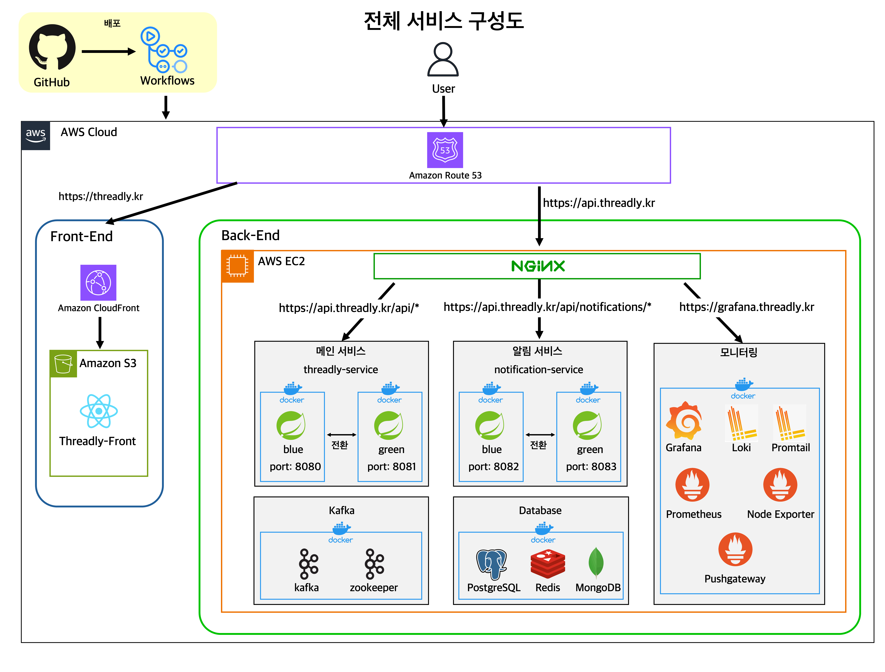

# Threadly

> 일상을 가볍게 기록하고, 가까운 사람들과 자연스럽게 연결되는 사진 기반 소셜 서비스

## 서비스 소개

문득 떠오르는 일상의 순간, 친구에게 조용히 들려주고 싶은 이야기,
기록해두고 싶은 작은 감정들.

그럴 때 자연스럽게 꺼내 쓸 수 있는 공간이 있다면 어떨까요?

사진과 짧은 글 한 줄로 편하게 일상을 남길 수 있고

친구들의 소식을 살펴볼 수 있습니다.

누군가와 가볍게 연결되고 싶은 순간에 팔로우로 관계를 이어가고,

특정 친구에게만 보여주고 싶은 이야기는 따로 선택해서 공유할 수도 있습니다.

기록하고 싶은 날도, 사람들과 소통하고 싶은 날도

그 모든 순간을 자연스럽게 담아둘 수 있는 공간.

Threadly는 그런 순간을 위해 만들어졌습니다.

**Threadly**: https://threadly.kr

### 특징

> Threadly는 단순한 SNS 구현을 넘어,
>
> 실무 서비스 수준의 구조와 운영 환경을 목표로 설계되었습니다.

- 헥사고날 아키텍처 기반의 명확한 계층 분리 및 설계로 유연한 확장성 확보
- `Kafka` 이벤트 기반의 MSA 구조 구현
- AWS `EC2` + `Docker Compose` 기반의 운영 환경 구성 및 실제 서비스 운영
- `S3`, `CloudFront`를 이용한 프론트엔드 배포 및 운영
- `Blue-Green` 전략을 이용한 무중단 배포 환경 구축
- `Prometheus`, `Grafana`, `Loki`를 활용한 모니터링 / 로그 수집 / 운영 가시성 확보
- `Github Actions` 기반의 완전 자동화 `CI`/`CD` 파이프라인 구축
- 테스트 전략, `Fixture` 기반 테스트, 부하 테스트 등 입증 가능한 테스트 환경

---

## 사용 기술 스택

### Backend

- Java 17
- Spring Boot (Security, JPA, WebSocket, Batch)
- Kafka 기반 비동기 이벤트 처리

### Database & Storage

- PostgreSQL (주 데이터베이스)
- MongoDB (알림 서비스)
- Redis (캐싱)
- Flyway (DB 마이그레이션)

### DevOps & Infrastructure

- Docker / Docker Compose
- GitHub Actions (CI/CD)
- Nginx
- AWS EC2, S3, CloudFront

### 모니터링

- Prometheus, Grafana
- PushGateway
- Loki + Promtail (로그 수집)
- Spring Actuator

### 테스트

- JUnit 5, Mockito, AssertJ
- Jacoco (커버리지)
- K6 (부하 테스트)

---

## 개발 범위 및 역할

### 백엔드

- 백엔드 전반 설계 및 구현
- MSA, 헥사고날 아키텍쳐, DDD, CQRS, Kafka 기반의 비동기 이벤트 처리 설계
- 인증/인가, 예외 처리, 로깅, CI/CD, 모니터링, AWS 배포 환경 구성 등 **백엔드 전 영역 직접 구현**

### 프론트엔드

- **`Codex`를 활용해 프론트엔드 구현**
- `Threadly` 백엔드 API와 연동될 수 있도록 구조 조정 및 일부 수정
- 배포 환경(`S3` + `CloudFront`) 구성 및 연결

---

## 전체 서비스 구성도



---

## Threadly 구성 서비스

## Backend(MSA 구조)

Threadly는 **MSA**기반으로 2개의 서비스로 구성되며,

각 서비스는 독립적으로 배포되고 `Kafka` 이벤트로 연결됩니다.

모든 백엔드 서비스는 **Docker 기반으로 컨테이너화**되어

**AWS `EC2` 환경에서 무중단 배포 됩니다.**

> 자세한 문서는 [백엔드 운영 환경 구성 위키 문서](https://github.com/KimGyuBek/Threadly/wiki/%EC%9A%B4%EC%98%81-%EC%84%9C%EB%B2%84-%EA%B5%AC%EC%84%B1)에서 확인할 수 있습니다.

### threadly-service (메인 서비스)

- 사용자, 게시글, 댓글, 검색 , 팔로우 등 **핵심 도메인을 담당하는 메인 서비스**
- https://github.com/KimGyuBek/threadly-service

### notification-service (알림 서비스)

- `Kafka` 메세지를 기반으로 **알림 처리를 담당하는 알림 서비스**
- https://github.com/KimGyuBek/notification-service

## Frontend

웹 프론트엔드는 **Codex로 구현** 되었으며,

**AWS `S3` + `CloudFront`를 통해 배포됩니다.**

https://github.com/KimGyuBek/threadly-frontend

> 자세한 문서는 [프론트엔드 운영 환경 구성 위키 문서]()에서 확인할 수 있습니다.

---

## 백엔드 시스템 설계
Threadly는 단순 CRUD 중심의 서비스가 아니라,

확장성과 유지보수성, 테스트 용이성을 장기적으로 확보하기 위한 구조적 설계를 목표로 했습니다.

"어떤 구조가 유지 보수, 확장, 테스트에 가장 유리한가"를 고민하여 설계했고,

그 과정에서 다음과 같은 핵심 아키텍처를 적용했습니다.

- [헥사고날 아키텍처](https://github.com/KimGyuBek/Threadly/wiki/%ED%97%A5%EC%82%AC%EA%B3%A0%EB%82%A0-%EC%95%84%ED%82%A4%ED%85%8D%EC%B3%90)
- [MSA](https://github.com/KimGyuBek/Threadly/wiki/MSA)
- [CQRS 설계](https://github.com/KimGyuBek/Threadly/wiki/CQRS-%EC%84%A4%EA%B3%84)
- [객체지향 설계](https://github.com/KimGyuBek/Threadly/wiki/OOP-%EC%84%A4%EA%B3%84-%EC%9B%90%EC%B9%99)
- [도메인 주도 설계](https://github.com/KimGyuBek/Threadly/wiki/DDD-%EC%84%A4%EA%B3%84)
- [도메인 모델 / JPA 엔티티 분리 설계](https://github.com/KimGyuBek/Threadly/wiki/%EB%8F%84%EB%A9%94%EC%9D%B8-%EB%AA%A8%EB%8D%B8%EA%B3%BC-JPA-%EC%97%94%ED%8B%B0%ED%8B%B0-%EB%B6%84%EB%A6%AC-%EC%84%A4%EA%B3%84)
 
---


## CI/CD 파이프라인 구축

Threadly는 **`Github Actions` 기반으로 테스트/빌드/배포까지 자동화된 파이프라인**을 구성했습니다.
또한 `Slack`을 이용한 워크 플로우의 성공 유무 및 관련 PR 생성?

> 자세한 문서는 [CI/CD 상세 위키 문서](https://github.com/KimGyuBek/Threadly/wiki/CI-CD-%EB%8F%99%EC%9E%91-%ED%94%84%EB%A1%9C%EC%84%B8%EC%8A%A4)에서 확인할 수 있습니다.


---

## 테스트 전략

Threadly는 도메인 로직 -> `Adapter` -> API 흐름까지 전 구간을 검증하는 다층 테스트로 구성되어 있습니다.

- `app-api` 모듈에서 실제 시나리오 및 요청 흐름을 기반으로 **API 통합(E2E 성격) 테스트**를 수행, 실제 서비스에서 환경에서 발생할 수 있는 대부분의 흐름 검증
- `core-service`, `adapter` 등 개별 모듈의 단위 테스트로 도메인 로직과 외부 연동 안정성 확보
- `Jacoco`로 **전체 커버리지 측정 및 관리**
- 주요 기능은 대부분 테스트로 보장되어 안정적인 배포 관리

### 테스트 커버리지
threadly-service
```text
====================================================================================================
MODULE                     INSTRUCTION       BRANCH         LINE       METHOD        CLASS
----------------------------------------------------------------------------------------------------
core-domain                      44.3%        44.4%        53.3%        43.7%        37.5%
core-service                     88.0%        87.1%        85.8%        93.3%        97.1%
threadly-commons                 29.6%        12.9%        42.9%        25.3%        33.3%
adapter-persistence              75.8%        87.5%        78.8%        69.1%       100.0%
adapter-redis                    77.9%       100.0%        75.5%        80.4%       100.0%
adapter-storage                  90.2%       100.0%        85.7%       100.0%       100.0%
adapter-kafka                    14.4%         0.0%        17.7%        16.2%        14.3%
app-api                          90.2%        75.0%        90.2%        87.9%        91.8%
app-batch                         8.5%         3.8%        10.6%        27.3%        41.4%
====================================================================================================
```

이 커버리지는 다음과 같은 특징을 가집니다.
- 핵심 비즈니스 로직은 80~90%대 높은 커버리지 유지
- API 흐름 전체를 검증하는 `app-api` 모듈은 사실상 E2E 수준으로 전체 시나리오 검증
- 영속성 계층(`adapter` 모듈)도 단위 테스트를 추가하여 안정성 확보
- CI 파이프라인에서 자동 실행되며, 커버리지 결과는 `Job Summary`로 즉시 확인 가능

> 자세한 문서는 [테스트 상세 위키 문서](https://github.com/KimGyuBek/Threadly/wiki/%ED%85%8C%EC%8A%A4%ED%8A%B8-%EA%B5%AC%EC%A1%B0-%EB%B0%8F-%EC%A0%84%EB%9E%B5)
에서 확인할 수 있습니다.
> 
> CI 워크플로우 결과의 예시는 [CI 워크플로우 결과](https://github.com/KimGyuBek/threadly-service/actions/runs/19262210745)에서 확인할 수 있습니다.

---

## 기술적 의사 결정
Threadly는 도메인 중심 구조, 확장성, 명확한 책임 분리를 목표로 설계한 서비스입니다.

이 과정에서 다양한 구조적 선택지와 설계 상충점들을 마주하게 되었고,

그때마다 "왜 이 방식을 선택했는가"를 명확히 남기기 위해 기술적 의사 결정 문서를 정리했습니다.

> [기술적 의사 결정](https://github.com/KimGyuBek/Threadly/wiki/%EA%B8%B0%EC%88%A0%EC%A0%81-%EC%9D%98%EC%82%AC%EA%B2%B0%EC%A0%95)


---

## 트러블 슈팅
개발 과정에서 발생했던 기술적 문제들과 해결 과정을 정리한 트러블 슈팅 문서입니다.

- [서비스 추가로 인한 운영 서버 다운](https://github.com/KimGyuBek/Threadly/wiki/%EC%84%9C%EB%B9%84%EC%8A%A4-%EC%B6%94%EA%B0%80%EB%A1%9C-%EC%9D%B8%ED%95%9C-%EC%9A%B4%EC%98%81-%EC%84%9C%EB%B2%84-%EB%8B%A4%EC%9A%B4-%ED%8A%B8%EB%9F%AC%EB%B8%94-%EC%8A%88%ED%8C%85)
- [알림 발행 실패 시 전체 트랜잭션 롤백](https://github.com/KimGyuBek/Threadly/wiki/%EC%95%8C%EB%A6%BC-%EB%B0%9C%ED%96%89-%EC%8B%A4%ED%8C%A8-%EC%8B%9C-%EC%A0%84%EC%B2%B4-%ED%8A%B8%EB%9E%9C%EC%9E%AD%EC%85%98-%EB%A1%A4%EB%B0%B1-%ED%8A%B8%EB%9F%AC%EB%B8%94-%EC%8A%88%ED%8C%85)
- [하드 딜리트 배치 성능 저하](https://github.com/KimGyuBek/Threadly/wiki/%ED%95%98%EB%93%9C-%EB%94%9C%EB%A6%AC%ED%8A%B8-%EB%B0%B0%EC%B9%98-%EC%84%B1%EB%8A%A5-%EC%A0%80%ED%95%98-%ED%8A%B8%EB%9F%AC%EB%B8%94-%EC%8A%88%ED%8C%85)
- [Swagger UI와 ResponseBodyAdvice 충돌 문제](https://github.com/KimGyuBek/Threadly/wiki/Swagger-UI%EC%99%80-ResponseBodyAdvice-%EC%B6%A9%EB%8F%8C-%EB%AC%B8%EC%A0%9C-%ED%8A%B8%EB%9F%AC%EB%B8%94-%EC%8A%88%ED%8C%85)
- [게시글 삭제 시 연관 데이터 삭제 동기 처리로 인한 성능 문제](https://github.com/KimGyuBek/threadly-service/issues/75)
- [Spring Batch 메타 테이블 Flyway 충돌 문제](https://github.com/KimGyuBek/Threadly/wiki/Spring-Batch-%EB%A9%94%ED%83%80-%ED%85%8C%EC%9D%B4%EB%B8%94%EA%B3%BC-Flyway-%EC%B6%A9%EB%8F%8C-%ED%8A%B8%EB%9F%AC%EB%B8%94-%EC%8A%88%ED%8C%85)
- [Filter 단계에서 예외 발생 시 오류 응답 누락 문제](https://github.com/KimGyuBek/Threadly/wiki/Filter-%EB%8B%A8%EA%B3%84%EC%97%90%EC%84%9C-%EC%98%88%EC%99%B8-%EB%B0%9C%EC%83%9D-%EC%8B%9C-%EC%98%A4%EB%A5%98-%EC%9D%91%EB%8B%B5-%EB%88%84%EB%9D%BD-%ED%8A%B8%EB%9F%AC%EB%B8%94%EC%8A%88%ED%8C%85)
- [Flyway 마이그레이션 체크섬 불일치 문제 트러블슈팅](https://github.com/KimGyuBek/Threadly/wiki/Flyway-%EB%A7%88%EC%9D%B4%EA%B7%B8%EB%A0%88%EC%9D%B4%EC%85%98-%EC%B2%B4%ED%81%AC%EC%84%AC-%EB%B6%88%EC%9D%BC%EC%B9%98-%EB%AC%B8%EC%A0%9C-%ED%8A%B8%EB%9F%AC%EB%B8%94%EC%8A%88%ED%8C%85)
- [DB 환경 차이로인한 쿼리 오류 트러블 슈팅](https://github.com/KimGyuBek/Threadly/wiki/DB-%ED%99%98%EA%B2%BD-%EC%B0%A8%EC%9D%B4%EB%A1%9C%EC%9D%B8%ED%95%9C-%EC%BF%BC%EB%A6%AC-%EC%98%A4%EB%A5%98-%ED%8A%B8%EB%9F%AC%EB%B8%94%EC%8A%88%ED%8C%85)
- [blue-green 배포 시 업로드 파일 손실 트러블 슈팅](https://github.com/KimGyuBek/Threadly/wiki/blue-green-%EB%B0%B0%ED%8F%AC-%EC%8B%9C-%EC%97%85%EB%A1%9C%EB%93%9C-%ED%8C%8C%EC%9D%BC-%EC%86%90%EC%8B%A4-%ED%8A%B8%EB%9F%AC%EB%B8%94-%EC%8A%88%ED%8C%85)

---

## Threadly WIKI
Threadly를 개발하며 정리한 설계 문서, 기술적 고민, 문제 해결 과정은 

모두 WIKI에 정리해 두었습니다.

아키텍처, 설계 방식, CI/CD, 테스트 전략, 트러블 슈팅까지

Threadly의 핵심 기술 흐름과 설계 기준을 WIKI에서 자세하게 확인할 수 있습니다.

> [Threadly WIKI](https://github.com/KimGyuBek/Threadly/wiki)

